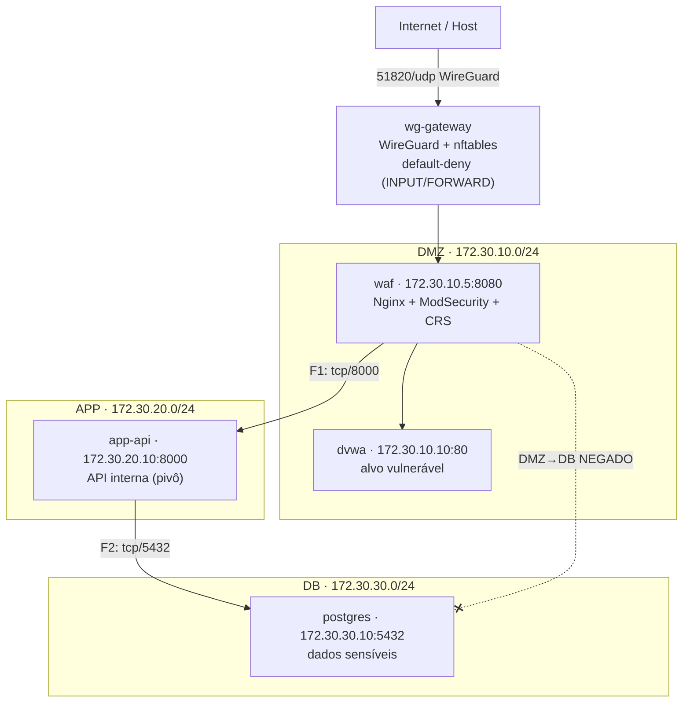

# Laboratório de Segurança Ofensiva e Defensiva — Rede Segmentada

Ambiente de rede corporativa segmentada que sobe **com um único comando** e permite
demonstrar o ciclo completo de segurança: **reconhecimento → exploração → movimentação
lateral → exfiltração → contenção**, com evidência reproduzível em cada etapa.

O relatório técnico completo (com evidências) está em **[`Relatorio_Tecnico_HW.pdf`](Relatorio_Tecnico_HW.pdf)**.

---

## 1. Visão geral

Um único host, orquestrado por `docker-compose`, com **quatro redes isoladas** e um
**container-roteador** (`wg-gateway`) que concentra e filtra todo o tráfego entre
segmentos com `nftables` em política *default-deny*. A entrada administrativa é feita
por **VPN WireGuard** (SSH apenas por chave); o alvo web (DVWA) fica atrás de um
**WAF (Nginx + ModSecurity + OWASP CRS)**.

Princípio condutor: **tudo o que não é explicitamente permitido é negado.**

### Topologia



| Segmento | Rede | Host | Papel |
|---|---|---|---|
| Borda | `lab_edge` (172.31.0.0/24) | `wg-gateway` | Roteador/firewall + entrada VPN |
| DMZ | `172.30.10.0/24` | `waf` → `dvwa` | WAF à frente do alvo vulnerável |
| APP | `172.30.20.0/24` | `app-api` | API interna (pivô de movimentação lateral) |
| DB | `172.30.30.0/24` | `postgres` | Banco de dados com dados sensíveis |

### Regras de firewall (matriz)

| Regra | Origem → Destino | Porta | Ação |
|---|---|---|---|
| F1 | DMZ → APP (app-api) | tcp/8000 | ALLOW |
| F2 | APP → DB (postgres) | tcp/5432 | ALLOW |
| F-VPN | VPN → WAF | tcp/8080 | ALLOW |
| I1 | Internet → gateway | udp/51820 | ALLOW (WireGuard) |
| I2 | VPN → gateway | tcp/22 | ALLOW (SSH admin) |
| — | qualquer outro (ex.: DMZ→DB, →internet) | * | **DENY** (default) |

---

## 2. Pré-requisitos

- **Docker** + **Docker Compose** v2
- Cliente **WireGuard** ([wireguard.com/install](https://www.wireguard.com/install/))
- Cliente **SSH** (OpenSSH)
- `make` (opcional; no Windows use os comandos `docker compose` diretos)
- `bash` (Git Bash no Windows) para o gerador de segredos

> Testado em Docker Desktop (Windows/WSL2) e em Docker nativo (Linux).

---

## 3. Subir o ambiente (um comando)

Os segredos (chaves WireGuard/SSH e senha do banco) **não são versionados** — são
gerados localmente no primeiro `up`.

**Com `make` (Linux/macOS/WSL):**
```bash
make up
```

**Sem `make` (Windows/PowerShell ou qualquer host):**
```bash
bash scripts/gen-keys.sh        # gera chaves WireGuard + SSH + senha do DB (.env)
docker compose up -d --build
```

Comandos úteis: `make ps` (estado) · `make logs` · `make down` (para) · `make nuke`
(para e apaga volumes).

---

## 4. Acesso ao ambiente

### 4.1. VPN (obrigatória para alcançar o lab)
1. Importe **`gateway/wireguard/client.conf`** no cliente WireGuard.
2. **Ative** o túnel. A partir daqui você alcança a rede do laboratório.

### 4.2. Administração — SSH somente por chave, via VPN
```bash
ssh -i gateway/ssh/admin_ed25519 root@10.13.13.1
```
Sem o túnel, o SSH é negado pelo firewall (admin somente via VPN). O login é apenas
por chave (autenticação por senha desabilitada).

### 4.3. Acessar o alvo (DVWA, através do WAF)
Com a VPN ativa, no navegador:
```
http://172.30.10.5:8080/setup.php    → clique em "Create / Reset Database"
http://172.30.10.5:8080/login.php    → usuário: admin  |  senha: password
```
Em **DVWA Security**, selecione **Low** para reproduzir os ataques. O acesso é
*VPN-gated*: o alvo nunca é exposto à internet, apenas alcançável de dentro do túnel,
sempre através do WAF.

---

## 5. Reproduzir a cadeia de ataque

O laboratório sobe em estado **attack-ready** (WAF em detecção, vulnerabilidades ativas).
O relatório detalha cada achado; em resumo, a cadeia de ponta a ponta é:

1. **Reconhecimento** — de 3 pontos de vista (externo, VPN, DMZ). Externamente, apenas
   a porta da VPN é visível; via VPN, apenas o WAF.
2. **Exploração do DVWA** — SQLi, XSS, upload inseguro, command injection, LFI, CSRF, etc.
3. **Foothold na DMZ** — upload de webshell no DVWA → execução de comando (RCE).
4. **Movimentação lateral** — do webshell (origem DMZ), alcance a `app-api` (regra F1).
5. **Exfiltração** — obtenha a credencial exposta pela API interna e, a partir de
   execução de comando na camada APP, use-a com o cliente `psql` para alcançar o
   PostgreSQL (regra F2) e extrair os dados sensíveis.

Ferramentas auxiliares incluídas: `scripts/wordlists/` (enumeração e brute force) e
`scripts/tools/hydra/` (imagem do Hydra). Payload de webshell documentado em
`evidence/stage06/payloads/`.

Ponto-chave da avaliação: mesmo de posse da credencial, o **acesso direto ao banco a
partir da DMZ permanece bloqueado** (a regra F2 só permite APP → DB). A segmentação de
rede contém o uso direto da credencial; a exfiltração só é possível pela cadeia legítima.

---

## 6. Ativar as defesas (antes / depois)

As mitigações são controladas por variáveis em `.env` e por uma regra de firewall.

### 6.1. WAF em modo de bloqueio + hardening da aplicação
No `.env`, ajuste e recrie:
```bash
WAF_MODE=On          # WAF passa a bloquear (403) SQLi/XSS
APP_HARDENED=1       # remove o endpoint que vaza credencial e corrige o command injection
```
```bash
docker compose up -d
```
Efeito: os ataques da Seção 5 passam a receber **403**; o endpoint `/internal/db-config`
retorna **404**; a injeção de comando é rejeitada com **400**.

> Nota — bypass do WAF: um XSS baseado em DOM entregue pelo *fragmento* da URL (`#`)
> não trafega até o servidor e não pode ser bloqueado pelo WAF. A correção adotada é
> defesa em profundidade: o WAF injeta um cabeçalho `Content-Security-Policy` que faz o
> navegador recusar scripts inline (ver `waf/conf/cors.conf`).

### 6.2. Contenção do movimento lateral (firewall)
Para conter o pivô do host comprometido, restrinja a regra **F1** para aceitar apenas o
WAF como origem. Em `gateway/nftables/ruleset.nft`, troque a linha da F1 por:
```
ip saddr 172.30.10.5 ip daddr 172.30.20.10 tcp dport 8000 ct state new accept
```
e recarregue:
```bash
docker exec wg-gateway nft -f /etc/nftables/ruleset.nft
```
Efeito: o DVWA comprometido (172.30.10.10) deixa de alcançar a `app-api`; o caminho
legítimo (WAF → app-api) é preservado.

---

## 7. Estrutura do repositório

```
docker-compose.yml        Orquestração das 4 redes + serviços
Makefile                  Alvos: up / down / keys / logs / nuke
.env.example              Modelo de configuração (segredos gerados localmente)
gateway/                  wg-gateway: WireGuard + nftables + SSH admin
  ├─ nftables/ruleset.nft   Firewall default-deny + regras F1/F2/F-VPN
  ├─ wireguard/             Template de config (chaves geradas em runtime)
  └─ ssh/                    Hardening do sshd + chave pública do admin
waf/                      Nginx + ModSecurity + OWASP CRS (+ CSP)
targets/
  ├─ dvwa/                  Alvo vulnerável (imagem oficial)
  ├─ app-api/               API interna (Flask) — pivô lateral
  └─ postgres/              Banco com seed de dados sensíveis
scripts/
  ├─ gen-keys.sh            Gera segredos (idempotente)
  ├─ wordlists/             Listas para enumeração e brute force
  └─ tools/hydra/           Imagem do Hydra
evidence/                  Evidências por etapa (stage01..stage09)
Relatorio_Tecnico_HW.pdf   Relatório técnico completo
```

---

## 8. Evidências e relatório

- **`evidence/`** contém, por etapa, o comando executado e a saída de cada verificação —
  incluindo as provas de "caminho negado sendo negado" (segmentação ativa).
- **`Relatorio_Tecnico_HW.pdf`** consolida arquitetura, mapa da superfície de ataque,
  relatório de pentest (achados, reprodução, impacto, CVSS), WAF (bloqueio/bypass/correção),
  hardening antes/depois, tabela de portas e discussão de escala para nuvem.

---

## 9. Notas de segurança

- **Nenhum segredo é versionado.** Chaves WireGuard/SSH, `client.conf` e a senha do
  banco (`.env`) são gerados localmente e ignorados pelo Git. Apenas chaves públicas e
  templates são versionados.
- **Entrega:** distribua via **Git** (os arquivos ignorados não são incluídos). Se for
  compactar a pasta manualmente, **exclua** antes: `.env`, `gateway/wireguard/*.key`,
  `gateway/wireguard/client.conf` e `gateway/ssh/admin_ed25519`.
- **Vulnerabilidades intencionais:** o DVWA é deliberadamente vulnerável (conforme o
  escopo). As falhas da `app-api` (exposição de credencial e command injection) são
  intencionais e documentadas, servindo para compor a cadeia de movimentação lateral.
- **Ambiente isolado:** o laboratório é destinado a execução local e controlada. Não
  exponha o alvo à internet.

---

## 10. Mapeamento para infraestrutura real

| Local | Nuvem / produção |
|---|---|
| `nftables` no gateway | Security Groups / NACLs (AWS); regras no Proxmox |
| Redes `internal` por segmento | Subnets/VPCs por camada, com egress-filtering |
| WAF Nginx + ModSecurity + CRS | WAF gerenciado (AWS WAF) / Cloudflare na borda |
| Gateway WireGuard + SSH por chave | VPN gerenciada / bastion host isolado |
| Default-deny em INPUT/FORWARD | Postura deny-all com liberações explícitas |
