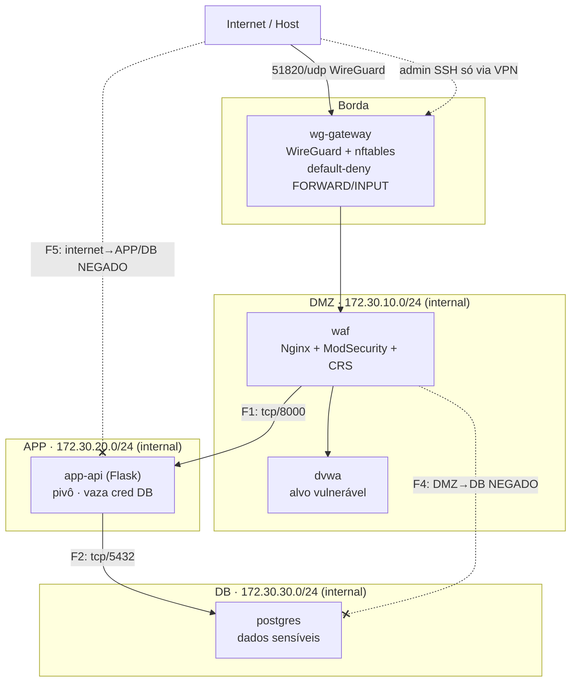

# Topologia — Diagrama

> Mermaid (renderiza no GitHub) + ASCII de fallback. Reusar no README (Parte 1).

## Mermaid



## ASCII (fallback)

```
                 Internet / Host
                        │  51820/udp (WireGuard)
                 ┌──────▼──────┐
                 │  wg-gateway │  nftables default-deny (FWD+INPUT)
                 └──┬────┬───┬─┘
        ┌───────────┘    │   └───────────┐
   ┌────▼─────┐     ┌────▼────┐     ┌────▼─────┐
   │   DMZ    │     │   APP   │     │    DB    │
   │ waf→dvwa │────▶│ app-api │────▶│ postgres │
   │ .10.0/24 │ F1  │ .20.0/24│ F2  │ .30.0/24 │
   └──────────┘8000 └─────────┘5432 └──────────┘
        └────────── F4: DMZ→DB NEGADO ─────────X
```

## Legenda
- **F1/F2/F4/F5** = regras da matriz em `../02-firewall-spec.md`.
- Linha cheia = fluxo permitido. Linha tracejada com X = fluxo negado (prova de segmentação).
- `internal: true` = rede sem rota pra internet; só o gateway conecta segmentos.
